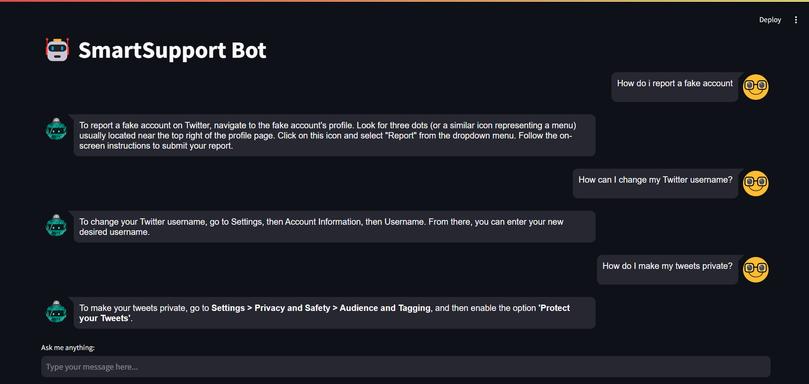

# SmartSupport Bot - AI Chatbot (Google RAG + Gemini)

SmartSupport Bot is an AI-powered chatbot that utilizes Google's RAG (Retrieval-Augmented Generation) and Gemini AI to assist users with queries. It retrieves relevant context from a document-based knowledge base and generates intelligent responses.

## 🚀 Features
- **Conversational Memory**: Maintains chat history using LangChain's `ConversationBufferMemory`.
- **Retrieval-Augmented Generation (RAG)**: Uses FAISS vector search to fetch relevant FAQ-based responses.
- **Google Gemini AI**: Generates intelligent responses using `gemini-1.5-flash`.
- **Streamlit Chat UI**: Provides an interactive chat interface with chat bubbles.
- **Efficient Indexing**: Uses FAISS to store and retrieve vectorized document embeddings.

## 🖼️ Chatbot UI Preview
Here’s how the chatbot looks:



## 📂 Project Structure
```
📦 Customer Support Chatbot - RAG
├── app.py                # Streamlit app with chatbot UI
├── chatbot.py            # Chatbot logic integrating Gemini AI & RAG
├── retriever.py          # FAISS-based document retriever
├── config.py             # API key configuration
├── requirements.txt      # List of dependencies
├── .env                  # Environment file (store API keys here)
├── docs/
│   ├── twitter_faq.txt   # FAQ dataset used for retrieval
└── faiss_index/          # FAISS vector database (generated at runtime)
```

## 🛠️ Installation
1. **Clone the repository**
```sh
git clone https://github.com/your-username/SmartSupport-Bot.git
cd SmartSupport-Bot
```

2. **Set up a virtual environment (optional but recommended)**
```sh
python -m venv venv
source venv/bin/activate  # On macOS/Linux
venv\Scripts\activate     # On Windows
```

3. **Install dependencies**
```sh
pip install -r requirements.txt
```

4. **Set up API keys**
- Create a `.env` file in the root directory and add your Google Gemini API key:
```sh
GEMINI_API_KEY=your_api_key_here
```

## ▶️ Running the Chatbot
Run the following command to start the chatbot:
```sh
streamlit run app.py
```

The chatbot UI will be accessible at `http://localhost:8501`.

## 📌 Technologies Used
- Python 🐍
- Streamlit 🎨
- Google Gemini AI 🤖
- LangChain 🔗
- FAISS (Facebook AI Similarity Search) 🔍

## Future Improvements
- ✅ Enhance chatbot UI for a better experience.
- ✅ Optimize document retrieval with advanced embeddings.
- ⏳ Integrate multi-turn conversations with better memory handling.
- ⏳ Deploy the chatbot as a web service using FastAPI.

## 🔧 Customization
- **Modify the FAQ dataset**: Update `docs/twitter_faq.txt` with your own FAQs.
- **Adjust retrieval behavior**: Change `top_k` in `retriever.py` to modify the number of relevant documents fetched.
- **Enhance UI**: Modify `app.py` to change the chatbot's appearance.

## 📜 License
This project is licensed under the MIT License.

## 🤝 Contributing
Feel free to open issues and submit pull requests to improve the chatbot!

---

Developed with ❤️ by Theertha 
